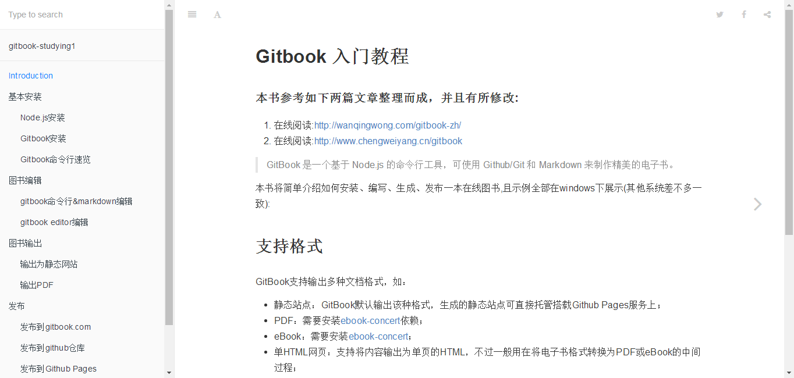

# gitbook简介

> 1. Modern book format and toolchain using Git and Markdown
> 2. GitBook 是一个基于 Node.js 的命令行工具，可使用 Github/Git 和 Markdown 来制作精美的电子书。

## 支持的输出格式

> - 静态站点：GitBook默认输出该种格式，生成的静态站点可直接托管搭载Github Pages服务上；
> - PDF：需要安装[ebook-concert](http://calibre-ebook.com/download)依赖；
> - eBook：需要安装[ebook-concert](http://calibre-ebook.com/download)；
> - 单HTML网页：支持将内容输出为单页的HTML，不过一般用在将电子书格式转换为PDF或eBook的中间过程；
> - JSON：一般用于电子书的调试或元数据提取。

**本书参考网址：**

1. [gitbook入门教程](https://yuzeshan.gitbooks.io/gitbook-studying/content/index.html)
2. [教你制作一本属于自己的gitbook](http://www.jianshu.com/p/4731abc562e7)

## gitbook发布完成效果

下图是本书使用到的参考链接1中图书例子发布图书后的效果图



**注：**初学markdown的时候，发现将图片拖拽到markdown编辑器图片的地址会变成本地的绝对路径，这样当你push到github上时，图片就不能正常显示了，因此建议使用相对路径，这样push到github上时图片也能正常显示。上图的代码为

```

##不管是在本地还是在网页上markdown编辑器都能够在README.md的同级目录imgs文件夹中找到相应的图片
```


