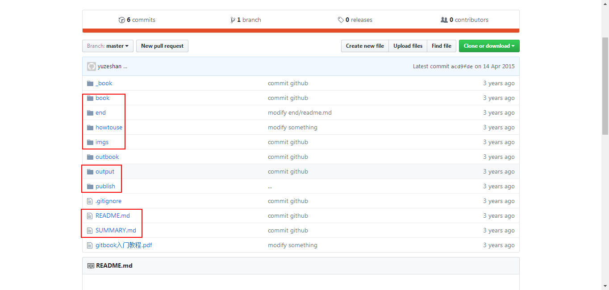

# 环境配置

- [首先下载安装node.js](http://www.gtwang.org/2013/12/install-node-js-in-windows-mac-os-x-linux.html   在 Windows、Mac OS X 與 Linux 中安裝 Node.js 網頁應用程式開發環境)

安装完后，在[git bash](https://git-for-windows.github.io/)（或者windows的cmd）中检验,若出现如下提示，表示安装成功：

```
$ node -v
v6.11.0
```

- 安装gitbook

```
$ npm install gitbook-cli -g
```

检验是否安装成功：

```
$ gitbook -V
CLI version: 2.3.2
GitBook version: 3.2.3
```

- 从[参考网址1](https://github.com/yuzeshan/gitbook-studying)下载本书使用的例子书籍

  

下载图中圈出来的文件和文件夹到本地，后续操作要用到。