# gitbook发布

###1. 在github上新建一个仓库

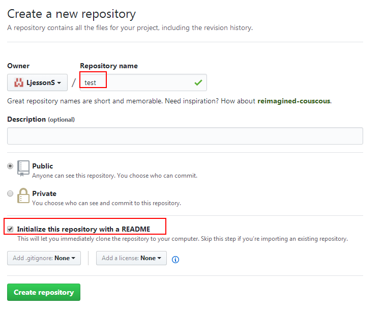

**clone到本地**

```
$ git clone git@github.com:LjessonS/test.git
Cloning into 'test'...
remote: Counting objects: 3, done.
remote: Total 3 (delta 0), reused 0 (delta 0), pack-reused 0
Receiving objects: 100% (3/3), done.
Checking connectivity... done.
```

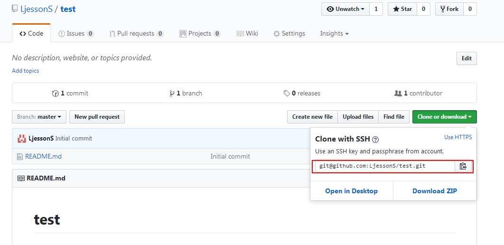


**创建一个新分支**

```
$ cd test/
$ git checkout -b gh-pages ##注意，分支名必须为 gh-pages
Switched to a new branch 'gh-pages'
```

**将分支 push 到仓库**

```
$ git push -u origin gh-pages
Total 0 (delta 0), reused 0 (delta 0)
To git@github.com:LjessonS/test.git
 * [new branch]      gh-pages -> gh-pages
Branch gh-pages set up to track remote branch gh-pages from origin.
```

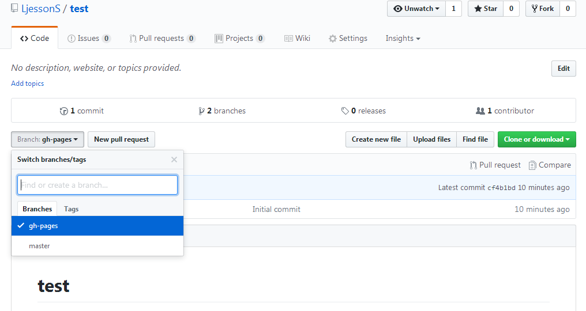

**切换到主分支**

```
$ git checkout master
Switched to branch 'master'
Your branch is up-to-date with 'origin/master'.
```

> 经过这一步处理，我们已经创建好 gh-pages 分支了，有了这个分支，GitHub 会自动为你分配一个访问网址：`http://USERNAME.github.io/**book`。**

**将远程仓库test的gh-pages分支clone到本地目录outbook**

```
$ cd ..
$ git clone -b gh-pages git@github.com:LjessonS/test.git outbook
Cloning into 'outbook'...
remote: Counting objects: 3, done.
remote: Total 3 (delta 0), reused 0 (delta 0), pack-reused 0
Receiving objects: 100% (3/3), done.
Checking connectivity... done.
```

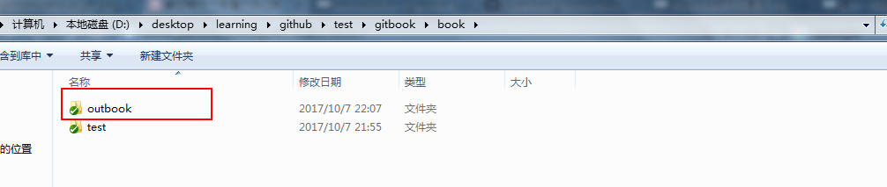

**将先前下载的书籍文件和文件夹以覆盖的方式拷贝到test文件夹中**

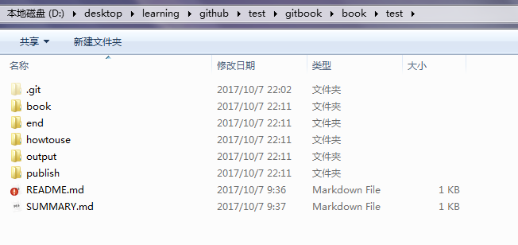

分别打开README.md文件和SUMMARY.md文件，代码如下：

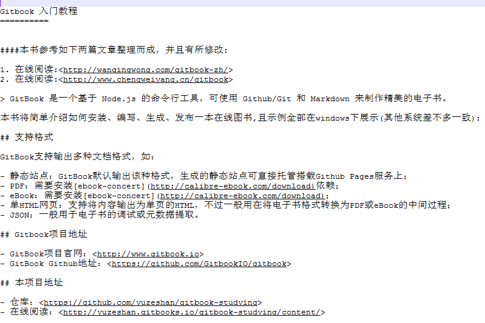

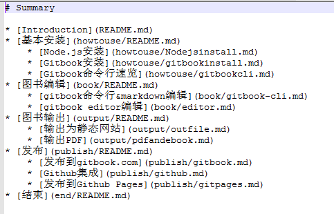

其实只需要这两个文件就可以生成一本书了，注意要SUMMARY.md中的markdown格式，按照这种格式，如第四行`* [基本安装](howtouse/README.md)`,当用gitbook init格式去初始化时，在README.md的同级目录就会出现howtouse的文件夹（即第一个章节），而这个文件夹下会出现README.md、Nodejsinstall.md、gitbookinstall.md、gitbookcli.md这四个文件，其他目录也是如此。下面进行演示。

**书籍目录初始化**

```
$ cd test/
$ gitbook init
info: create SUMMARY.md
info: initialization is finished
$ ls
book/  end/  howtouse/  imgs/  output/  publish/  README.md  SUMMARY.md
```

**输出为静态网站**

```
$ gitbook serve .
Live reload server started on port: 35729
Press CTRL+C to quit ...

info: 7 plugins are installed
info: loading plugin "livereload"... OK
info: loading plugin "highlight"... OK
info: loading plugin "search"... OK
info: loading plugin "lunr"... OK
info: loading plugin "sharing"... OK
info: loading plugin "fontsettings"... OK
info: loading plugin "theme-default"... OK
info: found 16 pages
info: found 22 asset files
info: >> generation finished with success in 2.5s !

Starting server ...
Serving book on http://localhost:4000
```

可以在浏览器中打开这个网址：[http://localhost:4000](http://localhost:4000/)，这时在test文件夹下出现了`_book`文件夹，而这个目录中的文件，即是生成的静态网站内容。也可以使用build参数生成到指定目录（这一步本书略过了，所以后面的图中没有看到`_book1`文件夹）。

> 1. mkdir _book1
> 2. cd..,退到上一层目录
> 3. 然后, $ gitbook build test test/_book1
> 4. 则在 test/_book1下生成了同样的静态html文件

**将本地master分支的改变提交到远程**

```
$ git status
On branch master
Your branch is up-to-date with 'origin/master'.
Changes not staged for commit:
  (use "git add <file>..." to update what will be committed)
  (use "git checkout -- <file>..." to discard changes in working directory)

        modified:   README.md

Untracked files:
  (use "git add <file>..." to include in what will be committed)

        SUMMARY.md
        _book/
        book/
        end/
        howtouse/
        imgs/
        output/
        publish/
$ git add *
$ git commit -m 'gitbook learning'
$ git push
```

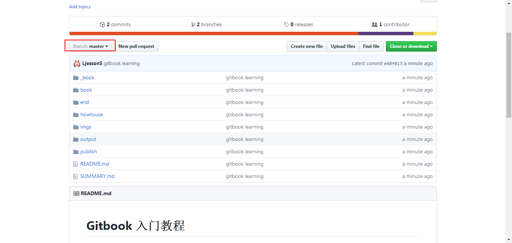

将_book文件夹下的电子书静态文件复制到outbook文件夹。

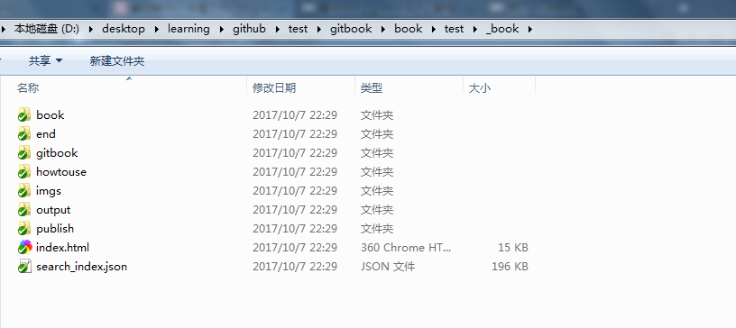

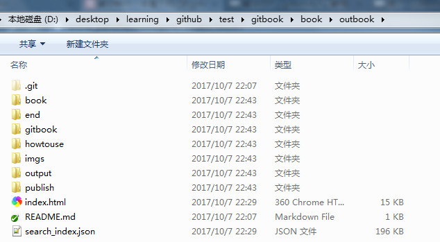

**然后将outbook文件夹下gh-pages分支的改变提交到远程**

```
git add *
git commit -m 'add gh-pages file'
git push
```

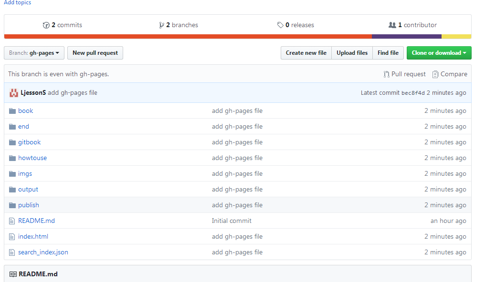

> 然后，等十来分钟的样子，你就可以通过访问网址：`http://USERNAME.github.io/test` 来访问到你的在线图书了。之后，每次修改之后，都可以将生成的静态文件 copy 到 book-build 目录，再 push 到远程仓库 book 的 gh-pages 分支。

一本书可以用一个类似于`http://USERNAME.github.io/test`这样的网址去访问，不太方便，gitbook可以帮我们把这些书籍管理起来。

##2.关联github和gitbook

**在[gitbook.com](https://www.gitbook.com)创建一本电子书**

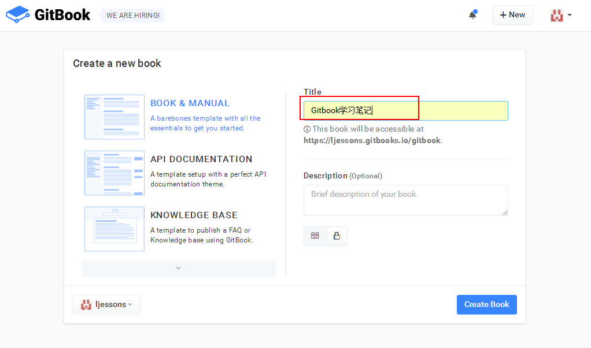

在账户设置里面连接github并install github integration，并允许获取所有的repositories(我的已经设置好了)

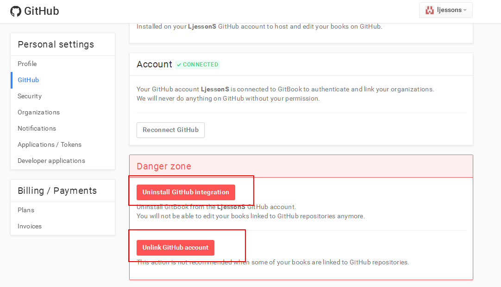

打开刚才新建的书籍，进入settings选项

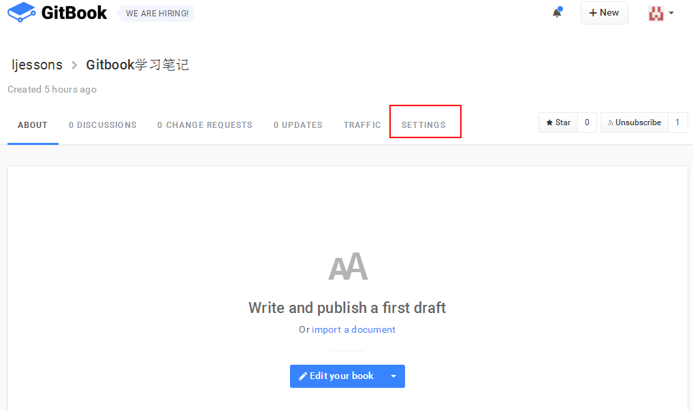

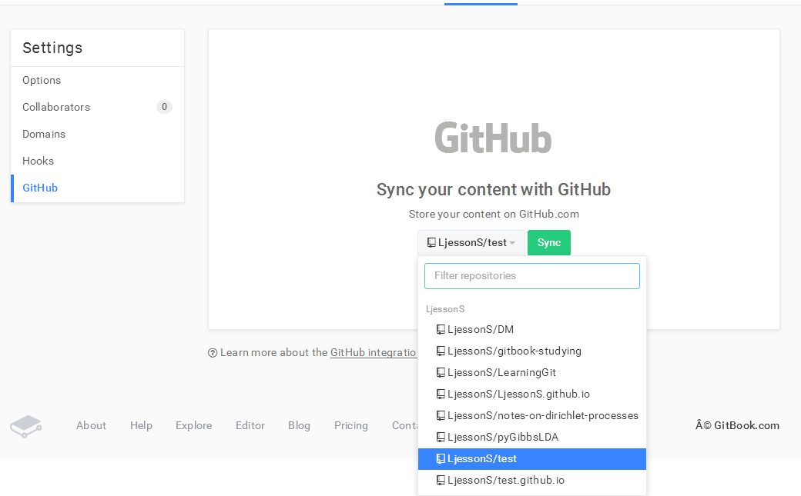

点击sync就可以将github上gh-page上的电子静态页面同步过来了。

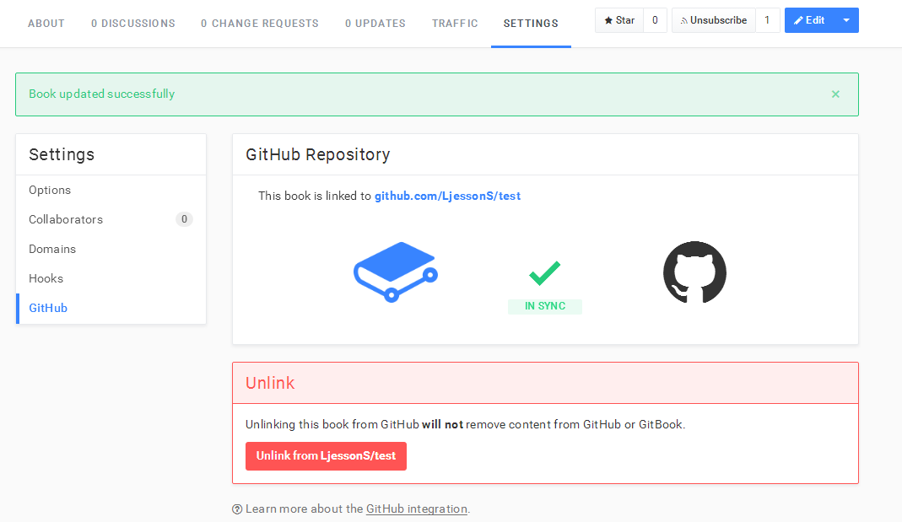


**大功告成**

> 之后，每次在 GitHub 上更新电子书时，都会自动同步到 gitbook.com，并且自动编译成电子书。

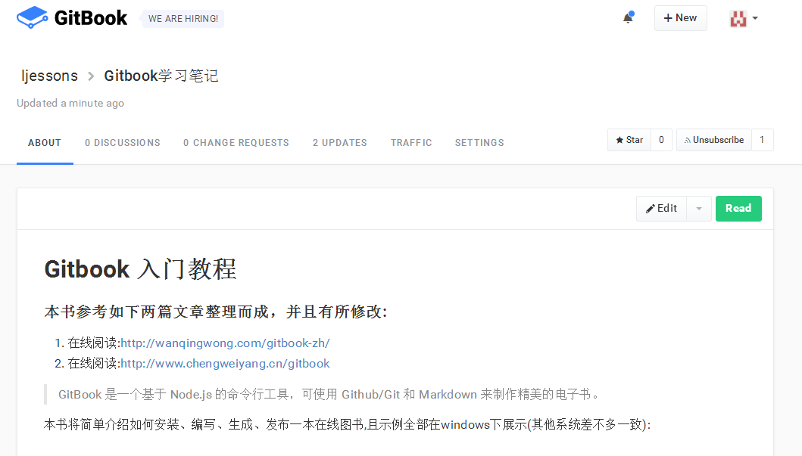